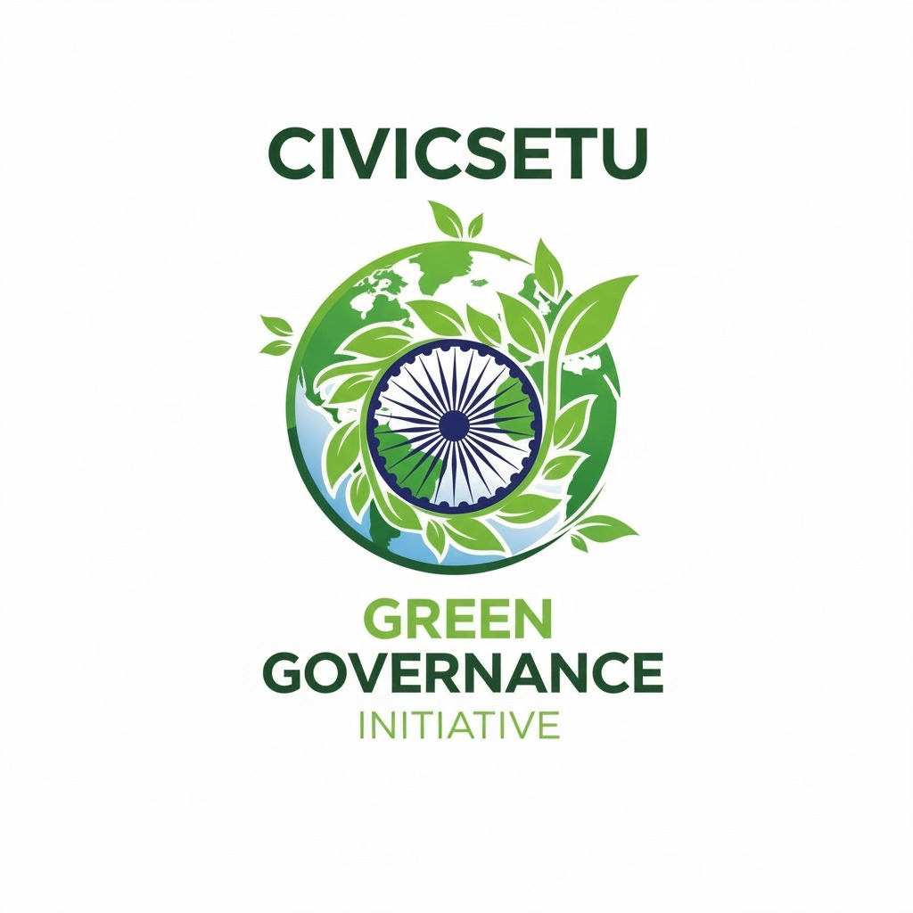
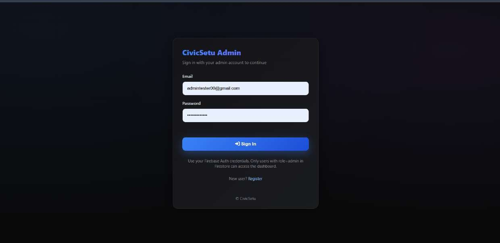
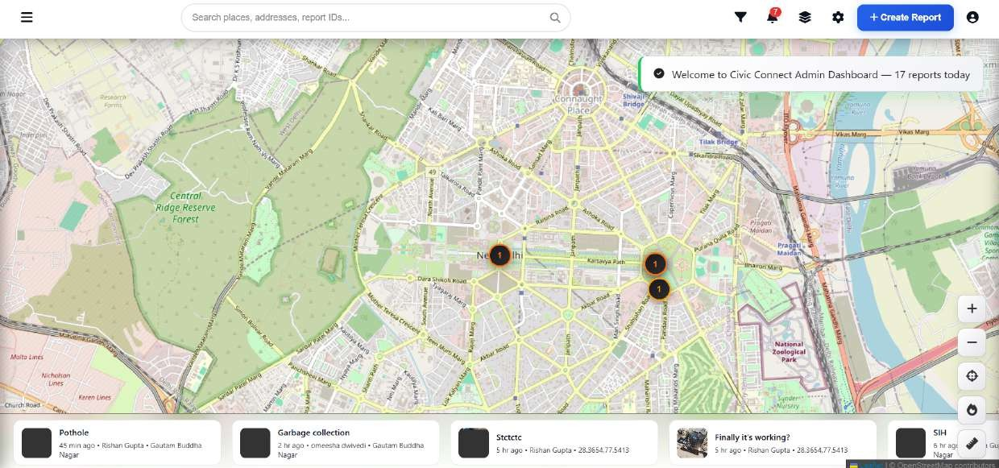
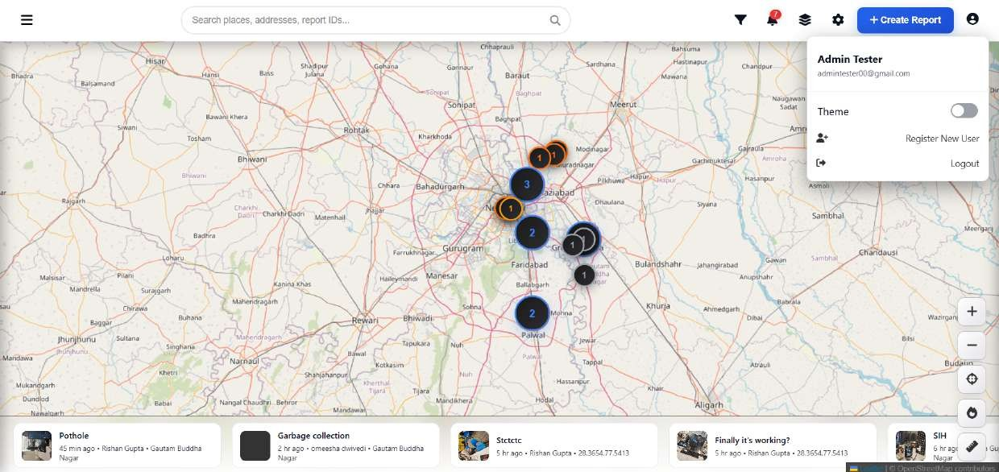
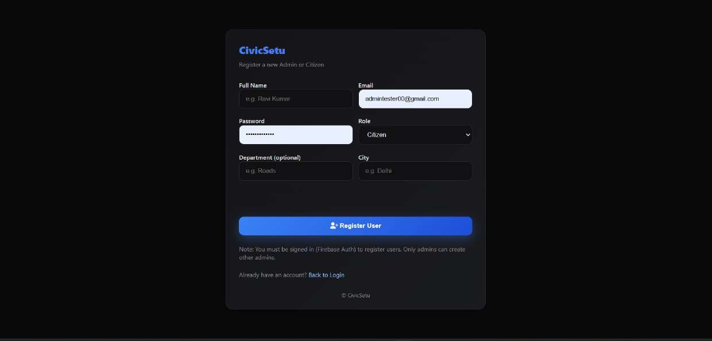
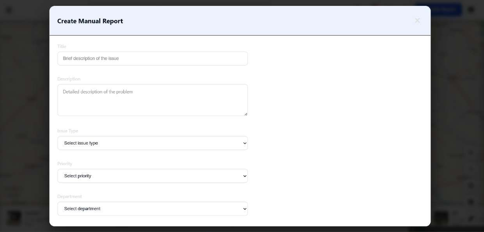
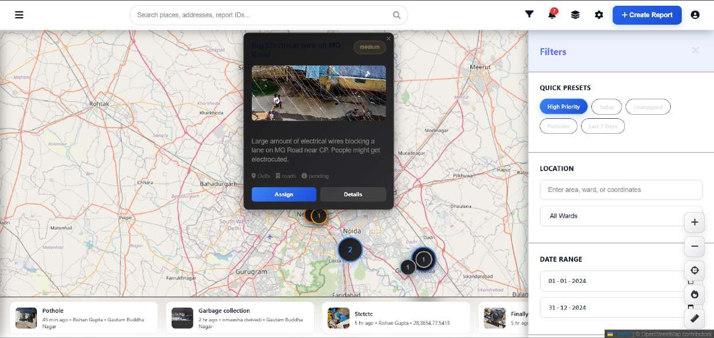
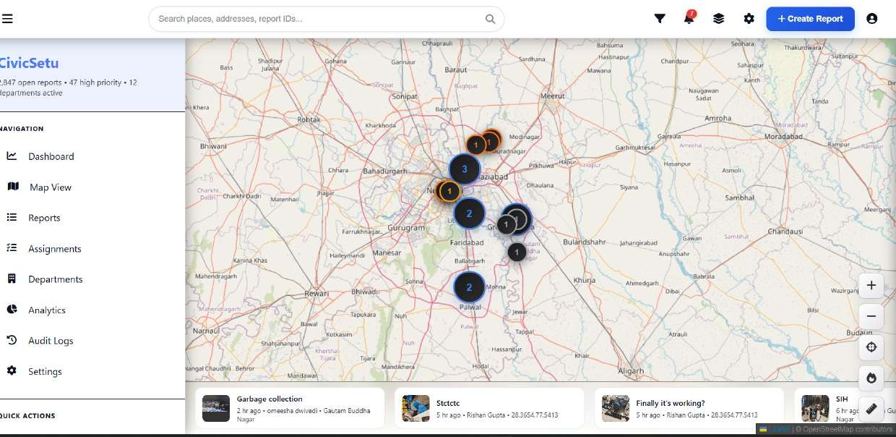
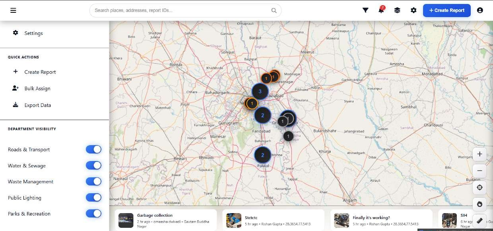
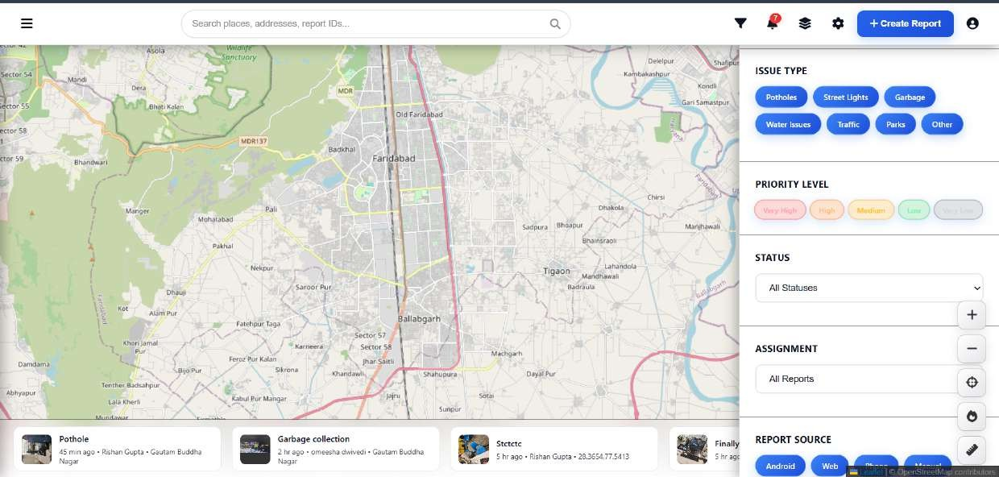

## CivicSetu 
*A Crowdsourced Civic Issue Reporting and Resolution System*

***

### Team & Problem Details

- **Team ID:** TID 212  
- **Problem Statement ID:** 25031  
- **Live Website:** https://civicconnect-th20.onrender.com/  
- **Admin Credentials (Demo):**  
  - **Username:** admintester00@gmail.com  
  - **Password:** AdminTester00  

***

## User Interface

### Admin Login

Admins securely log in to manage reports, monitor activity, and track overall system usage.

### Dashboard Overview

Provides a snapshot of total issues, categories, status, and quick access to pending actions.

  

### Navigating the Interface

Simple, mobile-first design ensures users and admins can move between sections easily.

### Registration of User

### Creating a Report

### Filtering Reports

### Navigation

### Department Visibility

### Priority View

***

## 1. Introduction

CivicSetu is an innovative, AI-powered platform designed to streamline civic issue reporting and resolution for the Government of Jharkhand, with the potential for nationwide scalability. The system bridges the communication gap between citizens and municipal authorities, providing a transparent, efficient, and accountable mechanism for addressing everyday problems like potholes, broken streetlights, and overflowing garbage.

This mobile-first solution empowers citizens to report issues effortlessly through multimodal inputs, including photos, speech-to-text, and text. The platform’s AI-driven backend automatically processes, categorizes, and routes these reports to the correct municipal departments, ensuring prompt and targeted action while fostering greater transparency, accountability, and public trust in governance.

***

## 2. Problem Statement

Local governments often struggle with the timely identification, prioritization, and resolution of civic issues. Existing grievance redress systems are typically slow, fragmented, and lack transparency, leading to delays, duplicated complaints, and inefficient resource allocation.

Despite encountering problems daily, citizens lack an effective and scalable channel to report them. CivicSetu addresses these systemic gaps by offering a streamlined, mobile-first solution that combines citizen-driven reporting with AI-powered processing.

***

## 3. Proposed Solution: CivicSetu

CivicSetu is a crowdsourced reporting and resolution system with a dual objective: empowering citizens and ensuring an efficient municipal response.  

The platform consists of two main components:  
- A mobile application for citizens.  
- A web-based administrative dashboard for municipal authorities.

***

## 4. Key Features

- **Multi-modal Input**  
  Citizens can submit reports using photos, speech-to-text, and text, with automatic location tagging for accurate issue pinpointing.

- **AI-driven Prioritization (≈80% accuracy)**  
  An intelligent engine predicts the severity and urgency of reported issues, enabling authorities to focus on the most critical problems first.

- **Translation Services**  
  Supports multilingual reporting with speech-to-text and text translation to ensure inclusivity.

- **Admin Dashboards**  
  Comprehensive dashboards provide municipal staff with tools for categorization, task routing, live map views, and real-time resolution tracking.

- **Chatbot Assistant**  
  Assists municipal staff with AI-suggested solutions for common and recurring issues.

- **Context-aware Deduplication**  
  Basic clustering based on location and content helps group similar reports, reducing duplicate complaints and identifying issue hotspots.

- **User-Friendly UI**  
  - Simple and intuitive design for easy navigation.  
  - Built-in translator for multilingual accessibility.  
  - Speech-to-text for quick reporting.  
  - Minimal steps to submit issues, avoiding complex workflows.  
  - Clear feedback loops to bridge the communication gap between citizens and authorities.

- **Leaderboard & Engagement**  
  Leaderboard highlights top reporters ranked by the number of issues submitted, motivating citizens and promoting healthy competition.

***

## 5. Methodology & Technical Approach

1. **Citizen Reporting**  
   Users capture and submit issues via the mobile app using photos, audio, video, or text.
2. **Metadata Enrichment**  
   Reports are automatically enriched with GPS coordinates and timestamps.
3. **AI Processing**  
   AI services (image captioning, speech-to-text, translation) generate a unified, standardized issue description.
4. **Clustering & Prioritization**  
   Radius-based clustering groups similar reports by location and content, while a prioritization engine analyzes severity, historical data, and context to predict urgency.
5. **Automated Routing**  
   Reports are routed to the relevant municipal departments based on issue category.
6. **Administrator Action**  
   Administrators use real-time dashboards with clustered issues and actionable insights to manage workloads efficiently.
7. **Citizen Updates**  
   Citizens receive real-time progress updates and resolution confirmations throughout the issue lifecycle.
8. **Feedback Loop**  
   Resolved case data is used to continuously retrain and improve AI models, adapting to changing urban dynamics.

***

## 6. Feasibility & Viability

CivicSetu is a mobile-first, cloud-enabled solution built for scalability, reliability, and cost efficiency. Its modular architecture supports seamless integration with existing municipal e-governance systems via open APIs.

The system can be easily expanded to new cities without major re-engineering, making it a highly viable and sustainable solution for adoption across India.

***

## 7. Impact & Benefits

- **For Citizens**  
  Provides an easy, transparent, and efficient way to report issues and receive real-time updates.

- **For Administrators**  
  Reduces redundant workloads, prioritizes tasks with AI-powered insights, and improves overall workload management.

- **For Governance**  
  Optimizes resource allocation, enhances public safety, and builds trust with citizens.

- **For Communities**  
  Fosters cleaner and safer environments through active civic engagement.

- **For Scalability**  
  Offers a replicable and adaptable model for any Indian city.

- **For Engagement**  
  The Leaderboard motivates citizens to actively report issues, fostering healthy competition and a sense of community contribution.

CivicSetu also provides a clear visual of issue hotspots and helps allocate resources efficiently by focusing on high-density clusters of civic issues.

***

## 8. Novelty

CivicSetu distinguishes itself through several unique features:

- **Multi-modal Integration** – Combines text, speech, image, and video inputs for comprehensive reporting.  
- **Offline-first Capability** – Stores reports locally using SQLite + Room and syncs automatically when internet is available.  
- **Context-aware Clustering** – Uses geospatial and semantic clustering to manage duplicate complaints effectively.  
- **AI-driven Prioritization** – Dynamically predicts urgency based on severity, accident mentions, and historical patterns.  
- **Leaderboards & Rewards** – Encourages sustained engagement through reward systems and leaderboards.  
- **Dynamic Clustering** – Radius-based clustering helps authorities identify hotspots, with adjustable parameters by urban density.  
- **Predictive Analytics** – Supports future problem forecasting (e.g., roads at risk of damage due to weather/traffic).  
- **Fraud Detection Mechanism** – Flags false or malicious reports to maintain system integrity.  
- **Multilingual Accessibility** – In-built translator and speech-to-text support reporting in regional languages.  
- **Chatbot Integration** – Assists administrators by suggesting practical solutions for frequently recurring issues.

***

## 9. Future Scope

Planned enhancements for CivicSetu include:

- **Predictive Problem Modeling**  
  Forecasting potential civic issues (e.g., predicting pothole formation using traffic and weather data).

- **Enhanced Multimedia Support**  
  Expanding support for richer audio and video uploads.

- **App-wide Translation**  
  Enabling support for all regional languages to ensure inclusivity across Pan-India, beyond Jharkhand.

- **Smart Notifications**  
  Sending timely notifications about route changes or diversions caused by broken roads or related civic issues.

***

## 10. Sustainability

CivicSetu is built on open-source frameworks and cost-efficient cloud infrastructure, ensuring low operational costs.  

Self-learning AI models adapt to changing urban dynamics, while citizen engagement mechanisms drive continued usage. Strategic collaboration with municipal bodies ensures relevance and long-term viability.

***

## 11. Technical Stack

- **Mobile Application:**  
  - Kotlin (Android)  
  - SQLite + Room for offline storage and auto-sync  

- **Backend:**  
  - Django (Python) for APIs, authentication, task routing, and clustering  

- **AI/ML Services:**  
  - Hugging Face for NLP, speech-to-text, translation, image captioning, and prioritization (text classification)  

- **Database & Cloud:**  
  - Firebase for real-time sync, notifications, and scalable storage  

- **Web Dashboard:**  
  - Django Admin + HTML, CSS, JavaScript for municipal staff dashboards  

***

## 12. Current Progress

The team is currently focused on:

- **Fraud Detection** – Implementing mechanisms to identify irrelevant or malicious reports.  
- **Notifications** – Ensuring citizens receive timely updates at every stage of the report lifecycle.  
- **Rewarding System** – Leaderboards, history pages, and reward mechanisms to encourage active participation.  
- **Dashboard of Analytics** – Real-time insights into reported issues, resolution rates, department performance, and citizen participation trends.

***

## 13. Conclusion

CivicSetu is more than a reporting tool; it is a catalyst for clean, green, and accountable governance. By blending cutting-edge AI technology with active citizen participation, it transforms how local governments respond to everyday challenges.

The solution aligns with the SIH 2025 theme of Clean & Green Technology and directly addresses Problem Statement ID 25031. With its focus on scalability, sustainability, and innovation, CivicSetu can become a model civic-tech platform for India, empowering citizens and authorities to collaboratively build a better future.
[8](https://blog.markdowntools.com/posts/markdown-change-image-size)
[9](https://www.educative.io/answers/how-to-change-image-size-in-markdown)
[10](https://github.com/hakimel/reveal.js/issues/1349)
